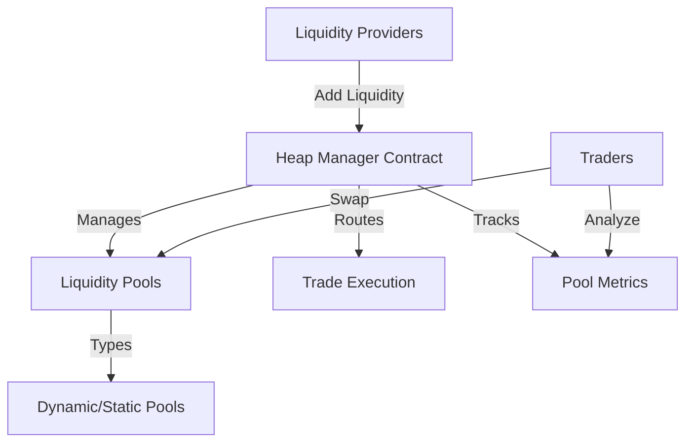

# AMM Heap Protocol

An efficient, low-gas AMM (Automated Market Maker) implementation using a custom heap data structure for optimized liquidity management and trade routing.

## Overview

AMM Heap is a next-generation decentralized exchange protocol that introduces:
- Advanced heap-based liquidity management
- Gas-efficient trade routing
- Flexible pool creation and interaction
- Optimized swap algorithms
- Enhanced computational efficiency

The protocol provides a novel approach to decentralized trading by leveraging advanced data structures to minimize computational overhead and maximize capital efficiency.

## Architecture

The system is built around a primary smart contract that manages:



### Core Components:
- Heap-based Liquidity Management
- Dynamic Pool Creation
- Efficient Trade Routing
- Swap Execution
- Metrics Tracking

## Contract Documentation

### heap-manager.clar

The main contract implementing the AMM Heap protocol's core functionality.

#### Key Features:
- Heap-based liquidity tracking
- Low-gas swap mechanisms
- Dynamic pool configuration
- Efficient trade routing
- Comprehensive pool metrics

#### Pool Types:
- `POOL-TYPE-DYNAMIC`: Flexible liquidity adjustment
- `POOL-TYPE-STATIC`: Fixed liquidity configuration
- `POOL-TYPE-CONCENTRATED`: Optimized capital efficiency

## Getting Started

### Prerequisites
- Clarinet
- Stacks wallet for deployment/interaction

### Basic Usage

1. Create a liquidity pool:
```clarity
(contract-call? .heap-manager create-pool 
    "STX-USDA"
    u100000   ;; initial liquidity
    u2        ;; pool type
)
```

2. Add liquidity:
```clarity
(contract-call? .heap-manager add-liquidity
    "STX-USDA"
    u50000    ;; STX amount
    u50000    ;; USDA amount
)
```

3. Execute a swap:
```clarity
(contract-call? .heap-manager swap
    "STX-USDA"
    u1000     ;; input amount
    true      ;; STX to USDA
)
```

## Function Reference

### Public Functions

#### Pool Management
- `create-pool`: Initialize a new liquidity pool
- `add-liquidity`: Provide liquidity to a pool
- `remove-liquidity`: Withdraw liquidity

#### Trading
- `swap`: Execute a token swap
- `get-swap-estimate`: Preview swap results
- `get-pool-metrics`: Retrieve pool statistics

#### Governance
- `update-pool-parameters`: Modify pool configuration
- `pause-pool`: Emergency pool suspension
- `resume-pool`: Reactivate suspended pool

## Development

### Testing
1. Clone the repository
2. Install Clarinet
3. Run tests:
```bash
clarinet test
```

### Local Development
1. Start Clarinet console:
```bash
clarinet console
```
2. Deploy contracts:
```clarity
(contract-call? .heap-manager ...)
```

## Security Considerations

### Liquidity Management
- Heap-based tracking minimizes computational complexity
- Dynamic pool types provide flexibility
- Built-in safety checks for liquidity operations

### Trade Execution
- Constant product formula implementation
- Slippage protection mechanisms
- Comprehensive input validation

### Limitations
- On-chain computation has inherent gas constraints
- Complex swap routes may incur higher gas costs
- Relies on oracle price feeds for accurate valuations